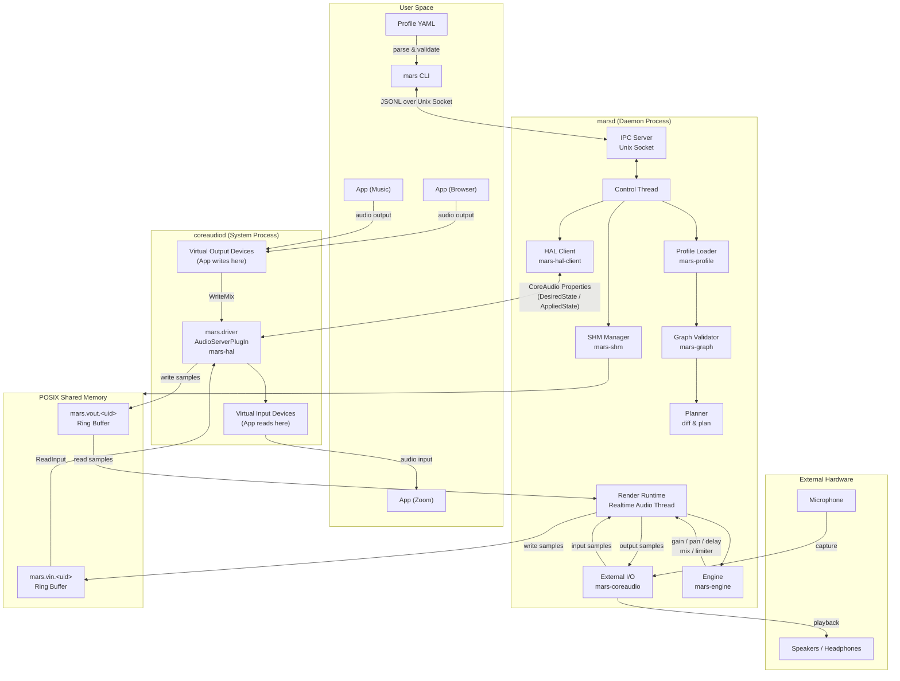
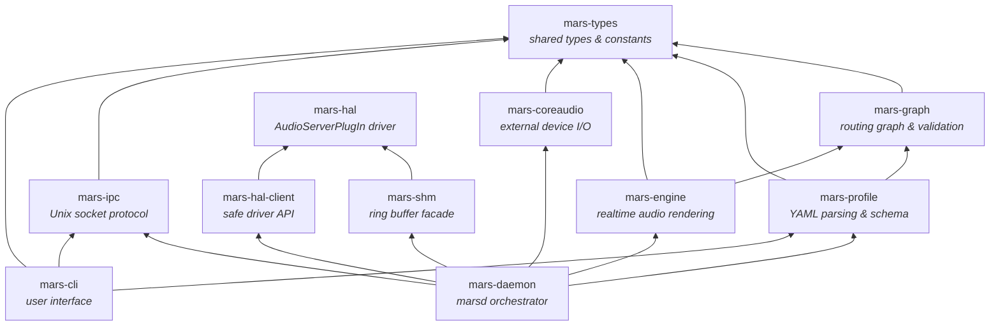
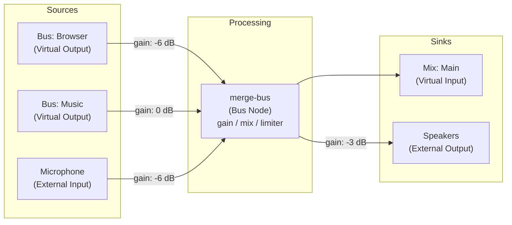

# MARS

MARS (macOS Audio Router Service) is an audio routing system for macOS.

## What is included

- `mars` CLI with commands: `create`, `open`, `apply`, `clear`, `validate`, `plan`, `status`, `devices`, `logs`, `doctor`
- `marsd` daemon with declarative apply transaction and rollback semantics
- `mars-hal` AudioServerPlugIn driver crate and `mars.driver` bundle scaffold
- Shared profile schema, graph validator, ring-buffer model, and realtime engine core

## Architecture



### Crate Dependency Graph



### Audio Routing Example



## Build

```bash
cargo build
cargo test
```

## Getting Started

See the full setup and first-run guide: `docs/getting-started.md`.

Quick install:

```bash
./scripts/install.sh
```

Run as your normal user (do not prefix with `sudo`).

For local-only development on SIP-disabled systems, you can explicitly opt in to insecure signing:

```bash
MARS_ALLOW_INSECURE_SIGNING=1 ./scripts/install.sh
```

Quick health check:

```bash
mars doctor
```

If logs report `Mars driver plugin not found in loaded CoreAudio plugins`, run:

```bash
sudo killall -9 coreaudiod
```

## Usage

```bash
mars create demo
mars open demo
mars validate demo
mars plan demo
mars apply demo
mars status --json
mars doctor
mars clear
```

## Uninstall

```bash
./scripts/uninstall.sh
```

Run as your normal user (do not prefix with `sudo`).

For more operational commands and runtime paths, see `docs/operator-guide.md`.

## Development run

```bash
cargo run -p mars-daemon --bin marsd -- --serve
```

`marsd` requires a real loaded `mars.driver` bundle.

## Logs

```bash
mars logs
./scripts/logs.sh
```
