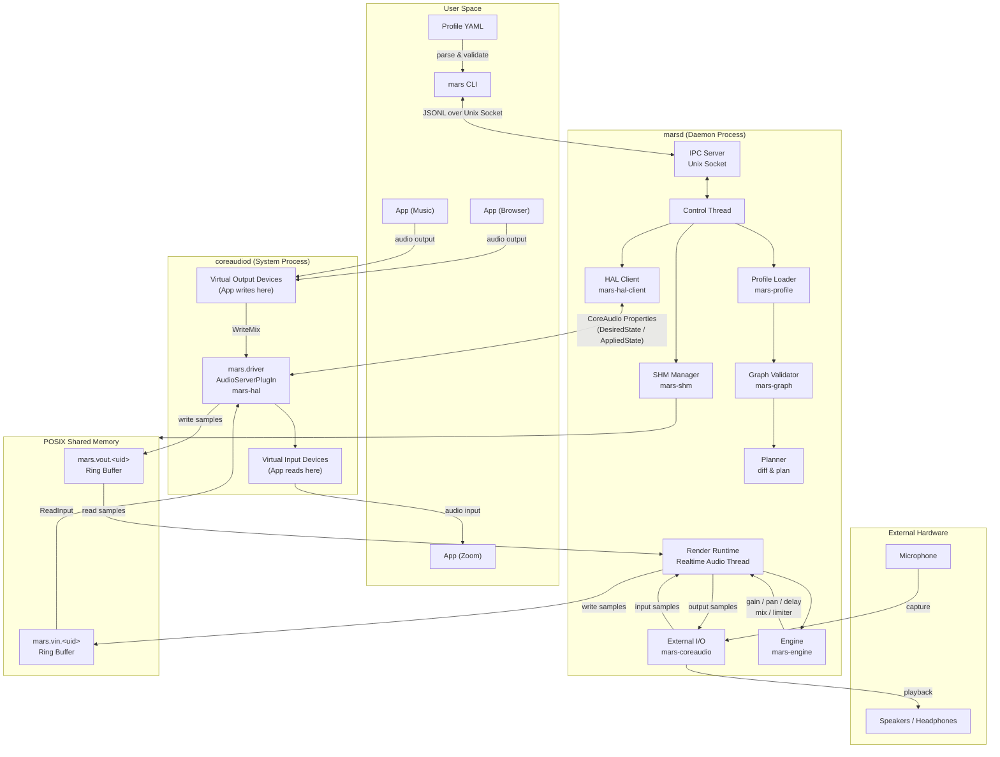
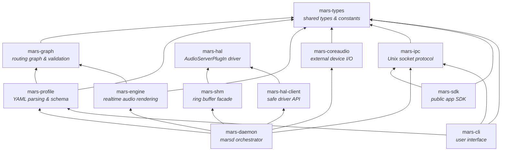
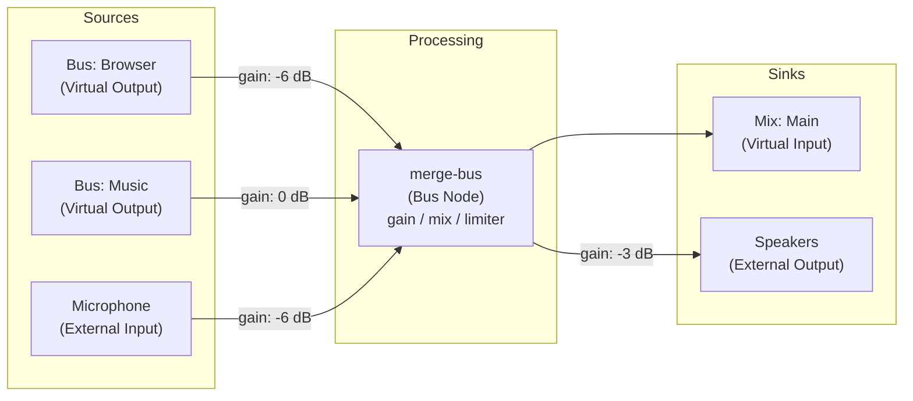

# MARS

MARS (macOS Audio Router Service) is an audio routing system for macOS 15+.

## What is included

- `mars` CLI with commands: `create`, `open`, `apply`, `clear`, `validate`, `plan`, `status`, `devices`, `processes`, `test`, `logs`, `doctor`
- `marsd` daemon with declarative apply transaction and rollback semantics
- `mars-sdk` Rust SDK crate for building external apps/tools on the typed MARS API
- `mars-hal` AudioServerPlugIn driver crate and `mars.driver` bundle scaffold
- Profile schema `version: 2` only (`version: 1` is rejected)
- Process/system capture tap model (`captures.process_taps` and `captures.system_taps`)
- Built-in file sinks (`sinks.files`) for WAV/CAF recording
- AUv2/AUv3 processor hosting through isolated `mars-plugin-host`
- Shared profile schema, graph validator, ring-buffer model, and realtime engine core

## Current limitations

- `sinks.streams` is an extensible descriptor model, but stream sink runtime is not implemented yet.
- When a stream sink is configured, runtime status/doctor surfaces it as failed with `last_error` details.

## Architecture



### Crate Dependency Graph



### Audio Routing Example



## Build

```bash
cargo build
cargo test
```

Engine robustness and perf checks:

```bash
cargo test -p mars-engine --test soak
cargo test -p mars-engine --release --test perf_gate -- --ignored
cargo bench -p mars-engine --bench engine -- engine/render_multisource_multioutput
cargo bench -p mars-daemon --bench daemon_ipc_shm
```

Benchmark gate policy, CI job mapping, and local reproduction commands:
`docs/performance-gates.md`.

## Getting Started

See the full setup and first-run guide: `docs/getting-started.md`.

Quick install:

```bash
./scripts/install.sh
```

Run as your normal user (do not prefix with `sudo`).

If you need local-only insecure signing for development, opt in explicitly:

```bash
MARS_ALLOW_INSECURE_SIGNING=1 ./scripts/install.sh
```

Quick health check:

```bash
mars doctor
```

If logs report `Mars driver plugin not found in loaded CoreAudio plugins`, run:

```bash
sudo killall -9 coreaudiod
```

## Usage

The default template includes process/system taps and a stream sink descriptor. Before `mars apply`, update or remove those entries so they match your host:
- use `mars processes --json` to select real process selectors (PID or bundle id)
- remove `captures` or `sinks.streams` entries you do not need

```bash
mars create demo
mars open demo
mars processes --json
mars validate demo
mars plan demo
mars apply demo
mars status --json
mars processes --json
mars doctor
mars test
mars test --route
mars clear
```

`mars test` measures internal MARS data-plane latency only.
`mars test --route` verifies the microphone-to-speaker and microphone-to-virtual-capture route.

## SDK

For third-party app/tool development, use the Rust SDK:

- docs: `docs/sdk.md`
- example: `cargo run -p mars-sdk --example status`

## Uninstall

```bash
./scripts/uninstall.sh
```

Run as your normal user (do not prefix with `sudo`).

For more operational commands and runtime paths, see `docs/operator-guide.md`.

## Development run

```bash
cargo run -p mars-daemon --bin marsd -- --serve
```

`marsd` requires a real loaded `mars.driver` bundle.

## Logs

```bash
mars logs
./scripts/logs.sh
```
